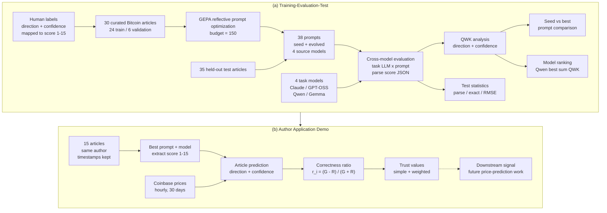

# Bitcoin News Prompt Optimization Study

## Project Summary

This repository studies whether GEPA prompt optimization helps large language models extract structured Bitcoin price-prediction signals from existing news articles. Instead of forecasting Bitcoin prices directly, the pipeline asks an LLM to read a curated article and output one ordinal `score` from 1 to 15, where low scores are bearish, middle scores are neutral, and high scores are bullish. GEPA was run on 30 manually labeled training articles to evolve extraction prompts, then 38 seed/evolved prompt candidates were evaluated across four task models on a 35-article held-out test set. The key result is mixed: GEPA produced longer, more domain-specific prompts, but GEPA-selected best prompts did not consistently beat the shared seed prompt on test QWK; Qwen 3.6 achieved the strongest combined direction/confidence QWK, while Claude Sonnet 4.6 achieved the strongest direction agreement.

## Codebase Map

```text
.
├── src/
│   ├── common/                  # JSONL reading/writing helpers
│   ├── data/                    # Pydantic schemas for canonical article records
│   └── evaluation/              # Prompt registry, parsing, scoring, aggregate metrics
├── scripts/
│   ├── convert_gold_standard_xlsx.py   # Convert annotated spreadsheets to JSONL
│   ├── run_gepa.py                    # Stage 1 GEPA prompt optimization runner
│   ├── run_test_eval.py               # Stage 2 full prompt x model test evaluation
│   ├── run_gepa_reports.py            # Build GEPA run figures and PDF reports
│   ├── build_qwk_inputs.py            # Convert test predictions into QWK inputs
│   ├── run_qwk_best_vs_seed.py        # Compare GEPA-best prompts with seed prompts
│   ├── run_qwk_per_model.py           # Aggregate QWK by task model
│   └── evaluate_author.py             # Optional author-level validation analysis
├── data/
│   ├── train/articles.jsonl           # 30 canonical GEPA training articles
│   ├── test/articles_test.jsonl       # 35 held-out test articles
│   ├── qwk/                           # Derived QWK input tables
│   └── authordemo/                    # Optional author-validation articles and BTC-USD CSV
├── outputs/
│   ├── gepa_runs/                     # GEPA candidates, run logs, reports, figures
│   ├── test_eval/                     # Per-prediction rows, matrices, metrics
│   ├── qwk/                           # QWK summary CSV/JSON outputs
│   └── test_author/                   # Optional author-validation outputs
├── BTC_Price_Sentiment_Prediction/    # Final ACM-style paper source and figures
├── tests/unit/                        # Fast unit tests with mocked/no live model calls
├── docker/research/Dockerfile         # Reproducible research image
├── docker-compose.yml                 # One-service research container
├── Makefile                           # Convenience commands
├── pyproject.toml                     # Python package and dependency metadata
└── README.md
```

## Architecture

The project is a research workflow, not a production trading system. No neural network is fine-tuned in this repository; the model architecture is the prompt-optimization and evaluation loop around external LLMs. The diagram below mirrors the teaser figure used in the final report.



Key insight from the report teaser: GEPA creates richer Bitcoin-specific prompts, but test-set gains are mixed. Evolved prompts often trade confidence calibration for direction accuracy, and the same structured extraction output can feed the exploratory author-trust demo.

## Data Contract

Canonical article datasets are JSONL files. Each line follows:

```json
{
  "article_id": "article-001",
  "text": "Full article text...",
  "title": "Bitcoin price prediction article title",
  "url": "https://example.com/article",
  "source": "Example News",
  "date": "2024-03",
  "gold_score": 15,
  "gold_reasoning": "The article argues that institutional demand will push BTC higher."
}
```

Human direction and confidence annotations are stored as one `gold_score`:

| Direction | Confidence | Score range |
|---|---:|---:|
| bearish | 1-5 | 1-5 |
| neutral | 1-5 | 6-10 |
| bullish | 1-5 | 11-15 |

The converted JSONL intentionally does not emit separate `gold_direction` or `gold_confidence` fields.

## Setup And Run

Requirements:

- Python `>=3.10.19`
- `uv`
- Docker and Docker Compose for reproducible container runs
- Optional API/model services for live runs:
  - `ANTHROPIC_API_KEY` for Claude Sonnet 4.6 runs
  - local Ollama server for GPT-OSS 120B, Qwen 3.6, and Gemma 4 E2B

Install locally:

```bash
cp .env.example .env
# edit .env with any live model credentials needed for your run
uv sync
```

Note: Ollama models must be pulled locally before running the Ollama-backed commands, and the Claude API key should be filled into `.env` as `ANTHROPIC_API_KEY`. If a reproduction command fails, Claude Code or Codex can be used as implementation assistants for debugging the local command/environment issue. In this experiment, model calls were run on a Dell GB10 workstation.

Validate the repository without live model calls:

```bash
uv run python -m pytest
uv run python -m ruff check .
uv run python scripts/run_gepa.py --dry-run data/train/articles.jsonl
uv run python scripts/run_test_eval.py --dry-run --expected-n 0
```

Build the Docker research image:

```bash
docker compose build research
```

## Reproduce Training And Evaluation

Convert source spreadsheets to canonical JSONL:

```bash
uv run python scripts/convert_gold_standard_xlsx.py
```

Run a GEPA smoke test:

```bash
docker compose run --rm research uv run python scripts/run_gepa.py \
  --budget 1 \
  --task-lm ollama_chat/gpt-oss:120b \
  --reflection-lm ollama_chat/gpt-oss:120b \
  --output outputs/gepa_runs/bitcoin_sentiment/smoke_result_001.json \
  --run-dir outputs/gepa_runs/bitcoin_sentiment/smoke_run_001 \
  data/train/articles.jsonl
```

Run full GEPA optimization for the four source models used in the completed study. Each run uses budget 150, with the task and reflection model set to the same LiteLLM-compatible model ID.

Claude Sonnet 4.6:

```bash
docker compose run --rm research uv run python scripts/run_gepa.py \
  --budget 150 \
  --task-lm anthropic/claude-sonnet-4-6 \
  --reflection-lm anthropic/claude-sonnet-4-6 \
  --output outputs/gepa_runs/bitcoin_sentiment/gepa_result_claude_sonnet46.json \
  --run-dir outputs/gepa_runs/bitcoin_sentiment/claude_sonnet46 \
  data/train/articles.jsonl
```

GPT-OSS 120B:

```bash
docker compose run --rm research uv run python scripts/run_gepa.py \
  --budget 150 \
  --task-lm ollama_chat/gpt-oss:120b \
  --reflection-lm ollama_chat/gpt-oss:120b \
  --output outputs/gepa_runs/bitcoin_sentiment/result_gptoss120b_b150.json \
  --run-dir outputs/gepa_runs/bitcoin_sentiment/run_gptoss120b_b150 \
  data/train/articles.jsonl
```

Qwen 3.6:

```bash
docker compose run --rm research uv run python scripts/run_gepa.py \
  --budget 150 \
  --task-lm ollama_chat/qwen3.6:latest \
  --reflection-lm ollama_chat/qwen3.6:latest \
  --output outputs/gepa_runs/bitcoin_sentiment/result_qwen36_b150.json \
  --run-dir outputs/gepa_runs/bitcoin_sentiment/run_qwen36_b150 \
  data/train/articles.jsonl
```

Gemma 4 E2B:

```bash
docker compose run --rm research uv run python scripts/run_gepa.py \
  --budget 150 \
  --task-lm ollama_chat/gemma4:e2b \
  --reflection-lm ollama_chat/gemma4:e2b \
  --output outputs/gepa_runs/bitcoin_sentiment/result_gemma4e2b_b150.json \
  --run-dir outputs/gepa_runs/bitcoin_sentiment/run_gemma4e2b_b150 \
  data/train/articles.jsonl
```

Run the Stage 2 test evaluation over the registered task models and prompt candidates:

```bash
uv run python scripts/run_test_eval.py --resume
```

For local Ollama models from Docker, make sure Ollama is reachable from the container:

```bash
docker run --rm --network host \
  --env-file .env \
  -e OLLAMA_API_BASE=http://localhost:11434 \
  -v "$(pwd)":/app -w /app \
  market_prediction_dl_final_project-research:latest \
  uv run python scripts/run_test_eval.py --resume
```

Regenerate analysis tables:

```bash
uv run python scripts/build_qwk_inputs.py
uv run python scripts/run_qwk_best_vs_seed.py
uv run python scripts/run_qwk_per_model.py
```

Regenerate a GEPA run report:

```bash
uv run python scripts/run_gepa_reports.py \
  --run-dir outputs/gepa_runs/bitcoin_sentiment/run_gptoss120b_b150
```

Run the optional author-level validation. This evaluates 15 FXStreet Bitcoin forecast articles from one author against the following 30 days of BTC-USD hourly prices. Articles without `gold_score` are first scored with a GEPA prompt and the selected scoring model. The `data/authordemo/` folder also includes `btc-usd-max.csv`, a local daily BTC-USD history file (`snapped_at`, `price`, `market_cap`, `total_volume`) spanning 2013-04-28 through 2026-05-04; the current script still fetches hourly Coinbase candles for the 30-day area calculation.

```bash
uv run python scripts/evaluate_author.py \
  --articles data/authordemo/author_test.jsonl \
  --output outputs/test_author/author_evaluation.csv \
  --score-prompt qwen36 \
  --score-model ollama_chat/qwen3.6:latest
```

## Results Summary

Main report artifacts are in `BTC_Price_Sentiment_Prediction/`, with the compiled paper also available as `Optimizing_Prompts_for_Extracting_Bitcoin_Price_Predictions_from_News_Articles.pdf`.

Stage 1 produced 38 prompt candidates across four source-model GEPA runs:

| Source model | Candidates | GEPA-selected best prompt words | Seed expansion |
|---|---:|---:|---:|
| Claude Sonnet 4.6 | 11 | 615 | 6.68x |
| GPT-OSS 120B | 7 | 92 | 1.00x |
| Qwen 3.6 | 11 | 714 | 7.76x |
| Gemma 4 E2B | 9 | 259 | 2.82x |

Overall QWK by task model, computed from `outputs/qwk/per_model/summary.csv`:

| Task model | Parsed rows | Parse rate | Direction QWK | Confidence QWK | QWK sum | MAE | Exact match |
|---|---:|---:|---:|---:|---:|---:|---:|
| Claude Sonnet 4.6 | 1081 / 1330 | 81.3% | **0.873** | 0.137 | 1.010 | **1.713** | 16.0% |
| GPT-OSS 120B | 1325 / 1330 | 99.6% | 0.792 | 0.270 | 1.061 | 1.922 | 22.3% |
| Qwen 3.6 | 662 / 805 | 82.2% | 0.794 | **0.385** | **1.178** | 1.923 | **24.5%** |
| Gemma 4 E2B | 1330 / 1330 | **100.0%** | 0.636 | 0.338 | 0.974 | 2.422 | 23.6% |

QWK seed-vs-best comparison selected from the final report, computed from `outputs/qwk/best_vs_seed/summary.csv`:

| Task model | Source prompt | Seed QWK sum | Best QWK sum | Delta sum |
|---|---|---:|---:|---:|
| Claude | Claude | 1.162 | 0.961 | -0.201 |
| Claude | Gemma | 1.106 | 1.075 | -0.031 |
| Claude | GPT-OSS | 1.106 | 1.106 | 0.000 |
| Claude | Qwen | 1.061 | 1.103 | +0.042 |
| Gemma | Claude | 1.182 | 1.099 | -0.083 |
| Gemma | Gemma | 1.117 | 1.245 | +0.128 |
| Gemma | GPT-OSS | 1.182 | 1.182 | 0.000 |
| Gemma | Qwen | 1.271 | 1.022 | -0.248 |
| GPT-OSS | Claude | 1.407 | 1.220 | -0.187 |
| GPT-OSS | Gemma | 1.353 | 1.129 | -0.224 |
| GPT-OSS | GPT-OSS | 1.427 | 1.427 | 0.000 |
| GPT-OSS | Qwen | 1.403 | 1.150 | -0.252 |
| Qwen | Claude | 1.316 | 1.175 | -0.141 |
| Qwen | Gemma | -- | -- | -- |
| Qwen | GPT-OSS | **1.433** | **1.433** | 0.000 |
| Qwen | Qwen | 1.401 | -- | -- |

Seed-vs-GEPA-best comparison from `outputs/qwk/best_vs_seed/summary.csv`: among 14 task/source pairs with both seed and best scores available, the combined direction-plus-confidence QWK improved in 2 cases, was unchanged in 4 cases, and decreased in 8 cases. This supports the paper's main conclusion: GEPA often made prompts more detailed and sometimes improved broad direction labeling, but it did not reliably improve calibrated 1-15 scoring on the held-out test set.

Optional author-level validation results are stored in `outputs/test_author/`. This stage used the Qwen 3.6 GEPA prompt to score 15 FXStreet "Bitcoin Price Forecast" articles by Manish Chhetri, then compared each extracted direction against Coinbase BTC-USD movement over the next 30 days. `data/authordemo/btc-usd-max.csv` is included as a daily historical BTC-USD reference dataset for this validation slice, while the reported area-based trust scores were generated from hourly Coinbase candles.

| Author-eval metric | Value | Interpretation |
|---|---:|---|
| Simple trust score | -0.080 | Unreliable / noisy |
| Confidence-weighted trust score | -0.123 | Unreliable / noisy |
| Very correct articles | 5 / 15 | Strong positive 30-day alignment |
| Correct articles | 1 / 15 | Positive 30-day alignment |
| Noisy articles | 2 / 15 | Inside the ambiguous band |
| Wrong articles | 3 / 15 | Negative 30-day alignment |
| Very wrong articles | 4 / 15 | Strong negative 30-day alignment |

By predicted direction, bearish calls were the strongest slice: 5 bearish calls averaged `+0.366`, while 4 neutral calls averaged `-0.343` and 6 bullish calls averaged `-0.275`. The aggregate author-eval conclusion is therefore noisy rather than trustworthy or consistently contrarian. See `outputs/test_author/author_evaluation_report.md` and `outputs/test_author/author_evaluation_summary.csv` for the per-article table.

Useful figures:

- `BTC_Price_Sentiment_Prediction/claude_prompt_evolution_tree.png`
- `BTC_Price_Sentiment_Prediction/keyword_heatmap_claude_sonnet46.pdf`
- `BTC_Price_Sentiment_Prediction/keyword_heatmap_gptoss120b.pdf`
- `BTC_Price_Sentiment_Prediction/keyword_heatmap_qwen36.pdf`
- `BTC_Price_Sentiment_Prediction/keyword_heatmap_gemma4e2b.pdf`

## AI Usage Log

LLM tools were used as part of the project workflow for prompt optimization, structured extraction, and documentation support:

| Use | Details |
|---|---|
| GEPA prompt optimization | GEPA used LLM task/reflection calls to generate and select prompt candidates from the 30-article training set. |
| Test-set extraction | Claude Sonnet 4.6, GPT-OSS 120B, Qwen 3.6, and Gemma 4 E2B were used as task models to emit structured `{ "score": ... }` predictions. |
| Analysis assistance | AI tools helped inspect outputs, summarize tables, and draft report/README language. Final metrics come from repository artifacts, not from manual estimation. |
| Safeguards | Unit tests and dry-run commands avoid requiring live model credentials; generated outputs are stored under `outputs/` for reproducibility and auditability. |

## Notes

- This repository intentionally does not implement the old trust-weighted trading pipeline.
- It does not include FastAPI serving, Streamlit dashboards, Temporal Fusion Transformers, or production trading workflows.
- Keep generated artifacts under `outputs/`, canonical datasets under `data/`, executable stage runners under `scripts/`, and business logic under `src/`.
